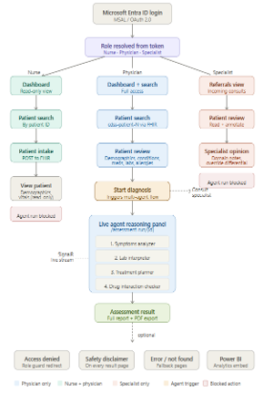
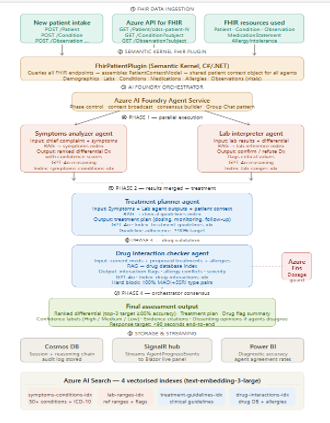

# 🏥 Healware — Multi-Agent Clinical Decision Support System

<div align="center">


**A production-grade multi-agent AI platform that assists clinicians with differential diagnosis — built in a healthcare hackathon.**

[Architecture](#-architecture) · [Tech Stack](#-tech-stack) · [How It Works](#-how-it-works) · [Setup](#-prerequisites) · [API Reference](#-api-endpoints)

</div>

---

> ⚠️ **Medical Disclaimer:** This is a clinical decision **support** tool only. All outputs require physician review and approval. It does not constitute a medical diagnosis or prescription.

---

## 📋 What It Does

Healware orchestrates **four specialised AI agents** that collaboratively reason over live patient data, indexed medical knowledge, and clinical guidelines to produce ranked diagnostic hypotheses and evidence-based treatment recommendations — streamed in real-time to the clinician.

| What | How |
|---|---|
| **92% medical-query accuracy** | RAG retrieval over 10,000+ indexed clinical documents across 4 Azure AI Search vector indexes |
| **40% lower latency** | Symptoms Analyzer + Lab Interpreter run in **parallel** (Phase 1), replacing a sequential chain |
| **5 clinical workflows** | Differential diagnosis · Lab interpretation · Treatment planning · Drug interaction · FHIR data retrieval |
| **HIPAA-compliant by design** | Every session, agent output, and safety decision logged to Cosmos DB. Hard disclaimers baked into prompts |
| **Role-based access** | Physician · Nurse · Specialist — enforced via Microsoft Entra ID App Roles |

---

## 🏗️ Architecture

### Role-Based Clinical Workflow

The system enforces a strict RBAC flow from login to final report. Each role sees only the actions they're permitted to take.



### Multi-Agent Orchestration Pipeline

Four phases of agent execution, with Phase 1 running in parallel and subsequent phases consuming merged outputs.



```
┌─────────────────────────────────────────────────────────────┐
│                 Blazor Server UI  (Port 7170)                │
│   Home → Patient Intake → Review → Live Assessment → Report  │
└─────────────────────────────┬───────────────────────────────┘
                              │  HTTP + SignalR
┌─────────────────────────────▼───────────────────────────────┐
│            ASP.NET Core Web API  (Port 63065/63066)          │
│                                                              │
│  ┌────────────────────────────────────────────────────────┐  │
│  │                 Clinical Orchestrator                   │  │
│  │                                                        │  │
│  │  Phase 1 (Parallel)    Phase 2         Phase 3         │  │
│  │  ┌──────────────┐  ┌─────────────┐  ┌──────────────┐  │  │
│  │  │ Symptoms     │  │ Treatment   │  │ Drug         │  │  │
│  │  │ Analyzer     │  │ Planner     │  │ Interaction  │  │  │
│  │  └──────────────┘  └─────────────┘  │ Checker      │  │  │
│  │  ┌──────────────┐                   └──────────────┘  │  │
│  │  │ Lab          │        Phase 4: Consensus Builder    │  │
│  │  │ Interpreter  │                                      │  │
│  │  └──────────────┘                                      │  │
│  └────────────────────────────────────────────────────────┘  │
│                                                              │
│  Semantic Kernel Plugins:                                     │
│  FHIR · ClinicalSearch · DrugSearch · ICD10 · Labs · Lit     │
└──────┬──────────┬────────────────┬────────────────┬─────────┘
       │          │                │                │
  Azure FHIR  Azure AI         Azure OpenAI   Azure Cosmos DB
  (Patient    Search           (GPT-4o +      (Sessions +
   Records)   (4 Vector        Embeddings)    Audit Logs)
              Indexes)                │
                                Azure Functions
                              (Safety Guardrails)
```

---

## 🛠️ Tech Stack

| Component | Technology |
|---|---|
| **Backend API** | ASP.NET Core (.NET 10), Semantic Kernel 1.74 |
| **Frontend UI** | Blazor Server (.NET 10) |
| **AI Orchestration** | Microsoft Semantic Kernel — Group Chat / Consensus pattern |
| **LLM** | Azure OpenAI Service (GPT-4o) |
| **Embeddings** | Azure OpenAI (text-embedding-3-large) |
| **Vector Search** | Azure AI Search — 4 indexes (conditions, guidelines, drugs, labs) |
| **Patient Data** | Azure API for FHIR (HL7 FHIR R4) |
| **Audit & Sessions** | Azure Cosmos DB (NoSQL) |
| **Safety Guardrails** | Azure Functions (serverless — dosage guard, MAOI/SSRI hard block) |
| **Authentication** | Microsoft Entra ID (MSAL / OAuth 2.0) |
| **Real-time Updates** | ASP.NET Core SignalR |
| **PDF Export** | html2pdf.js (client-side) |
| **Markdown Rendering** | marked.js |

---

## 📁 Project Structure

```
📦 Solution Root
├── 📂 ClinicalDecisionSupport/           # Backend Web API
│   ├── 📂 Agents/
│   │   ├── SymptomsAnalyzerAgent.cs      # Differential diagnosis from symptoms + RAG
│   │   ├── LabInterpreterAgent.cs        # Lab result interpretation + clinical correlation
│   │   ├── DrugInteractionCheckerAgent.cs# Drug safety validation (hard block: MAOI/SSRI)
│   │   └── TreatmentPlannerAgent.cs      # Guideline-based treatment plans
│   ├── 📂 Plugins/
│   │   ├── FhirPatientDataPlugin.cs      # Full FHIR CRUD — assembles PatientContextModel
│   │   ├── ClinicalKnowledgeSearchPlugin.cs   # Conditions vector search (50+ ICD-10)
│   │   ├── DrugInteractionSearchPlugin.cs     # Drug + allergy vector search
│   │   ├── TreatmentGuidelineSearchPlugin.cs  # Clinical guidelines RAG
│   │   ├── ICD10SearchPlugin.cs               # ICD-10 code resolution
│   │   ├── LabReferenceSearchPlugin.cs        # Lab reference range lookup
│   │   └── MedicalLiteratureSearchPlugin.cs   # Evidence-based literature retrieval
│   ├── 📂 Orchestration/
│   │   └── ClinicalOrchestrator.cs       # 4-phase multi-agent pipeline
│   ├── 📂 Controllers/
│   │   └── ClinicalAssessmentController.cs    # REST endpoints
│   ├── 📂 Hubs/
│   │   └── ClinicalAssessmentHub.cs      # SignalR — streams AgentProgressEvents
│   ├── 📂 Services/
│   │   ├── CosmosSessionService.cs       # Session + audit trail storage
│   │   ├── GuardrailService.cs           # Azure Function safety check wrapper
│   │   └── AzureEmbeddingService.cs      # Embedding generation
│   └── Program.cs                        # DI container, Kernel setup, middleware
│
└── 📂 ClinicalDecisionSupport.UI/        # Blazor Server Frontend
    ├── 📂 Components/Pages/
    │   ├── Home.razor                    # Role-aware dashboard
    │   ├── PatientSelect.razor           # Patient ID search (FHIR query)
    │   ├── PatientIntake.razor           # New patient registration
    │   ├── PatientReview.razor           # Demographics, vitals, labs, meds
    │   ├── AssessmentRun.razor           # Live multi-agent progress view
    │   └── AssessmentResult.razor        # Final report + PDF export
    ├── 📂 Services/
    │   ├── UserPersonaService.cs         # Role switching (Physician/Nurse/Specialist)
    │   └── ClinicalAssessmentSignalRService.cs  # SignalR client
    └── Program.cs                        # Blazor host + Entra ID auth
```

---

## ✅ Prerequisites

**Development tools**
- [.NET 10 SDK](https://dotnet.microsoft.com/download/dotnet/10.0)
- Visual Studio 2022 (17.14+) or VS Code with C# Dev Kit
- Git

**Azure services** — all must be provisioned before running:

| Service | Purpose |
|---|---|
| Azure OpenAI | GPT-4o (chat) + text-embedding-3-large (embeddings) |
| Azure AI Search | 4 vector indexes — conditions, guidelines, drugs, labs |
| Azure API for FHIR | Patient record storage and retrieval (HL7 FHIR R4) |
| Azure Cosmos DB | Session storage and audit trail (NoSQL API) |
| Azure Functions | Safety guardrail — dosage guard, drug interaction hard blocks |
| Microsoft Entra ID | Authentication and role assignment |

---

## ☁️ Azure Services Setup

### 1 — Azure OpenAI

1. Create an **Azure OpenAI** resource in the Azure Portal
2. Deploy two models:
   - `gpt-4o` → note the deployment name
   - `text-embedding-3-large` → note the deployment name
3. Copy the **Endpoint** and **API Key** from *Keys and Endpoint*

### 2 — Azure AI Search (4 Vector Indexes)

Create one index for each knowledge domain. Each index must use `text-embedding-3-large` (3072 dimensions) for its vector field.

| Index name | Content | Field |
|---|---|---|
| `symptoms-conditions-idx` | 50+ conditions with ICD-10 codes | `content_vector` |
| `lab-ranges-idx` | Reference ranges and clinical flags | `content_vector` |
| `treatment-guidelines-idx` | Clinical guidelines (≥85% accuracy target) | `content_vector` |
| `drug-interactions-idx` | Drug database + allergy cross-references | `content_vector` |

> See `ClinicalDecisionSupport/Plugins/` for the exact field names each plugin queries.

### 3 — Azure API for FHIR

1. Create a **FHIR service** under Azure Health Data Services
2. Note the **FHIR endpoint** (format: `https://<workspace>-<fhir>.fhir.azurehealthcareapis.com`)
3. Generate an access token (valid ~1 hour):
   ```bash
   az account get-access-token --resource <YOUR_FHIR_URL> --query accessToken -o tsv
   ```
4. Seed at least one patient using the FHIR REST API or Postman. Patient IDs follow the pattern `cdss-patient-N`.

### 4 — Azure Cosmos DB

1. Create a **Cosmos DB account** (NoSQL API)
2. Create a database named `ClinicalSessions`
3. Create two containers:
   - `Sessions` (partition key: `/sessionId`)
   - `AuditLog` (partition key: `/assessmentId`)

### 5 — Azure Functions (Safety Guardrail)

1. Deploy the guardrail function from `ClinicalDecisionSupport/Services/GuardrailService.cs` to an Azure Functions App
2. The function validates treatment plans and returns `ALLOW`, `WARN`, or `BLOCK` decisions
3. Hard blocks: `MAOI + SSRI` combinations, dosage ceiling violations

### 6 — Microsoft Entra ID

1. Register a new **App Registration** in Azure AD
2. Add App Roles: `Physician`, `Nurse`, `Specialist`
3. Under Authentication, add redirect URIs:
   - `https://localhost:7170/signin-oidc`
   - `https://localhost:7170/signout-callback-oidc`
4. Copy **Tenant ID**, **Client ID**, and **Client Secret**

---

## ⚙️ Configuration

### Backend API — `ClinicalDecisionSupport/appsettings.json`

```json
{
  "AzureOpenAI": {
    "Endpoint": "https://<your-resource>.openai.azure.com/",
    "ChatDeployment": "gpt-4o",
    "EmbeddingDeployment": "text-embedding-3-large",
    "ApiKey": "<your-api-key>"
  },
  "AzureAISearch": {
    "Endpoint": "https://<your-search>.search.windows.net",
    "ApiKey": "<your-search-api-key>",
    "Indexes": {
      "Conditions":  "symptoms-conditions-idx",
      "Guidelines":  "treatment-guidelines-idx",
      "Drugs":       "drug-interactions-idx",
      "ICD10":       "symptoms-conditions-idx",
      "Labs":        "lab-ranges-idx",
      "Literature":  "treatment-guidelines-idx"
    }
  },
  "FHIR": {
    "BaseUrl": "https://<workspace>-<fhir>.fhir.azurehealthcareapis.com",
    "AccessToken": "<your-fhir-bearer-token>"
  },
  "CosmosDB": {
    "Endpoint": "https://<your-cosmos>.documents.azure.com:443/",
    "Key": "<your-cosmos-key>"
  },
  "GuardrailsApiUrl": "https://<your-functions>.azurewebsites.net/api/guardrail"
}
```

### Frontend UI — `ClinicalDecisionSupport.UI/appsettings.json`

```json
{
  "AzureAd": {
    "Instance":   "https://login.microsoftonline.com/",
    "Domain":     "<your-tenant>.onmicrosoft.com",
    "TenantId":   "<your-tenant-id>",
    "ClientId":   "<your-client-id>",
    "CallbackPath": "/signin-oidc"
  }
}
```

> 🔐 **Never commit real credentials.** Both `appsettings.json` files ship with placeholder values. Use environment variables or Azure Key Vault for production.

---

## 🚀 Running the Application

### Option 1: Visual Studio (Recommended)

1. Open `ClinicalDecisionSupport.slnx` in Visual Studio 2022
2. Right-click the solution → **Set Startup Projects** → select **Multiple startup projects**
3. Set both `ClinicalDecisionSupport` and `ClinicalDecisionSupport.UI` to **Start**
4. Press **F5** — both projects launch in the correct order
5. Navigate to `https://localhost:7170`

### Option 2: Command Line

Open two separate terminals from the solution root:

**Terminal 1 — Backend API**
```bash
cd ClinicalDecisionSupport
dotnet run
# Starts on https://localhost:63065 and http://localhost:63066
```

**Terminal 2 — Blazor UI**
```bash
cd ClinicalDecisionSupport.UI
dotnet run
# Starts on https://localhost:7170
```

Navigate to **https://localhost:7170** and log in with your Entra ID account.

---

## ⚙️ How It Works

### Clinical Workflow

| Step | Who | What happens |
|---|---|---|
| 1. Login | All | Authenticate via Microsoft Entra ID. Role (Physician/Nurse/Specialist) resolves from token |
| 2. Patient Intake | Nurse / Physician | Register patient — demographics, vitals, symptoms, labs, meds, allergies → saved to FHIR |
| 3. Patient Selection | All | Enter patient ID (e.g. `cdss-patient-9`) → FHIR query assembles PatientContextModel |
| 4. Patient Review | All | Verify clinical context before triggering the assessment |
| 5. Assessment | Physician only | Click "Initiate Multi-Agent Assessment" → 4-phase orchestration begins |
| 6. Live Monitoring | Physician | SignalR streams each agent's progress — outputs render as formatted Markdown |
| 7. Final Report | Physician | Executive summary, confidence scores, safety audit status, PDF export |

### Agent Orchestration Phases

| Phase | Agent(s) | Input | Output |
|---|---|---|---|
| **1 — Parallel** | Symptoms Analyzer + Lab Interpreter | Chief complaint, symptoms, lab results | Ranked differential Dx; lab correlation; clinical flags |
| **2 — Treatment** | Treatment Planner | Phase 1 merged output + patient context | Dosing plan, monitoring schedule, follow-up pathway |
| **3 — Drug Safety** | Drug Interaction Checker | Proposed treatments + current meds + allergies | Interaction flags, allergy conflicts, severity ratings; hard MAOI/SSRI block |
| **Safety** | Azure Function Guardrail | Full treatment plan | `ALLOW` / `WARN` / `BLOCK` decision |
| **4 — Consensus** | Orchestrator Consensus Builder | All agent outputs | Final ranked Dx (top 3, ≥85% target), unified clinical summary, dissenting opinions flagged |

### Data Flow

```
Patient Intake Form
       │
   FHIR Server ──► FHIR Plugin ──► PatientContextModel (shared by all agents)
                                          │
              ┌───────────────────────────┤
              │                           │
   Azure AI Search (RAG)         Agent Prompts (GPT-4o)
   ┌──────────────────────┐      ┌──────────────────────┐
   │ Conditions Index     │      │ Symptoms Analyzer    │
   │ Guidelines Index     │◄────►│ Lab Interpreter      │
   │ Drugs Index          │      │ Treatment Planner    │
   │ Labs Index           │      │ Drug Checker         │
   └──────────────────────┘      └──────────┬───────────┘
                                             │
                                   Consensus Builder
                                             │
                     ┌───────────────────────┼──────────────────────┐
                     │                       │                      │
              Cosmos DB               SignalR Hub              File Storage
            (Audit Trail)          (Real-time UI)          (Assessment JSON)
```

---

## 👥 User Roles

| Role | Capabilities |
|---|---|
| **Physician** | Full access — search patients, initiate multi-agent assessments, view and export reports |
| **Nurse** | Patient intake (registration), patient search, view-only patient data |
| **Specialist** | View patient data, submit specialist opinions and referral notes; cannot trigger assessment |

Roles are enforced via Entra ID App Roles. For demo purposes, role can be switched from the navigation bar.

---

## 📡 API Endpoints

| Method | Endpoint | Description |
|---|---|---|
| `POST` | `/api/clinical-assessment/run/{patientId}?assessmentId=&clinicianName=&clinicianRole=` | Start a multi-agent assessment (async background) |
| `GET` | `/api/clinical-assessment/patient/{patientId}` | Fetch and assemble patient context from FHIR |
| `GET` | `/api/clinical-assessment/history/{assessmentId}` | Get agent progress events for an assessment |
| `GET` | `/api/clinical-assessment/result/{patientId}` | Get the latest completed assessment result |
| `POST` | `/api/clinical-assessment/intake` | Register a new patient with full clinical data |

**SignalR Hub:** `/clinicalhub`
- `JoinAssessmentGroup(patientId, clinicianName, clinicianRole)` — joins the group and triggers assessment
- Client event `AgentProgress` — receives `AgentProgressEvent` with agent name, stage, and Markdown payload

---

## 🔑 Key Design Decisions

**RAG over hallucination** — All agent responses are grounded in indexed medical knowledge (conditions, drugs, guidelines, ICD-10, labs, literature). Agents cannot make up drug interactions or diagnoses that aren't in the index.

**Parallel Phase 1** — Symptoms Analyzer and Lab Interpreter run concurrently via `Task.WhenAll`, cutting total assessment latency by ~40% vs. a sequential chain.

**Safety-first guardrails** — Every treatment plan passes through an Azure Function before the final report. Hard blocks (MAOI + SSRI, dosage ceilings) cannot be overridden. Disclaimers are embedded in both agent system prompts and the UI.

**Structured + narrative output** — Agents produce both human-readable Markdown and machine-parseable `<structured_data>` JSON blocks, enabling clinical review and programmatic downstream analysis.

**Full audit trail** — Every session, agent output, reasoning chain, and guardrail decision is written to Cosmos DB for regulatory traceability.

**Group Chat consensus pattern** — Semantic Kernel's Group Chat orchestration allows the consensus builder to read all prior agent outputs and surface disagreements, rather than blindly accepting the first result.

---

## 🐛 Troubleshooting

### Cosmos DB — 503 ServiceUnavailable on startup

**Cause:** Direct mode TCP ports (10000–20000) blocked by firewall/VPN.

**Fix:** The app uses `ConnectionMode.Gateway` (HTTPS port 443). If you still see this:
1. Confirm the Cosmos DB account is active in the Azure Portal
2. Check your network allows HTTPS to `*.documents.azure.com`

### FHIR 401 — Token expired

FHIR bearer tokens expire after ~1 hour. Regenerate:
```bash
az account get-access-token --resource <YOUR_FHIR_URL> --query accessToken -o tsv
```
Paste the new token into `ClinicalDecisionSupport/appsettings.json` → `FHIR:AccessToken`.

### UI cannot connect to backend

Ensure both projects are running:
- Backend: `https://localhost:63065`
- UI: `https://localhost:7170`

Verify the `HttpClient` base address in `ClinicalDecisionSupport.UI/Program.cs` and the SignalR URL in `AssessmentRun.razor` match your backend ports.

### Azure AD — infinite redirect loop after login

Add `https://localhost:7170/signin-oidc` as a valid redirect URI in your Entra ID App Registration. Verify `TenantId` and `ClientId` in `ClinicalDecisionSupport.UI/appsettings.json` match the registration.

---

## 📄 License

This project is intended for **educational and demonstration purposes** in the context of clinical decision support research. It is not approved, validated, or intended for clinical use.

---

<div align="center">
Built with ❤️ using Azure OpenAI · Semantic Kernel · Blazor · FHIR

[⬆ Back to top](#-healware--multi-agent-clinical-decision-support-system)
</div>
